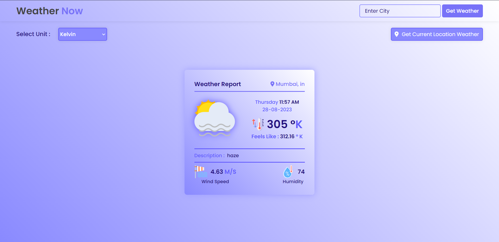
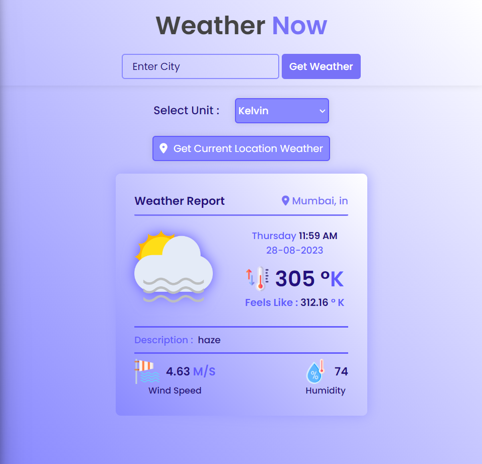

# Weather Now

Welcome to the Weather Now App! This web application allows you to check the current weather conditions for different locations around the world.

## Features

1. **Geolocation Permission**: The app asks for geolocation permission when loaded. If granted, it shows the weather for your current location. If denied, it displays default weather data for Mumbai.

2. **Unit Selection**: You can choose the unit (e.g., Celsius, Fahrenheit) for displaying temperature using a select input.

3. **City Search**: Enter a city name in the search input to check the weather for that specific location.

4. **Find Current Location**: Click the "Find My Location" button to fetch weather data for your current location (requires geolocation permission).

## Screenshots




## Demo

You can try the app live here: [Weather App Demo](https://weathernowbyabhi.netlify.app)

## Technologies Used

- HTML5
- CSS3
- JavaScript
- [OpenWeather API](https://openweathermap.org/api) for weather data
- [FontAwesome](https://fontawesome.com/) for icons

## How to Use

1. Clone the repository:

   ```shell
   git clone https://github.com/your-username/weather-app.git

2. Open index.html in your web browser.

3. Grant geolocation permission when prompted (or use the select input and city search if you denied geolocation).

4. Explore the app by checking the weather for your current location, changing temperature units, and searching for other cities.

# Contributions

Contributions are welcome! If you find any bugs or have suggestions for improvements, please open an issue or submit a pull request.